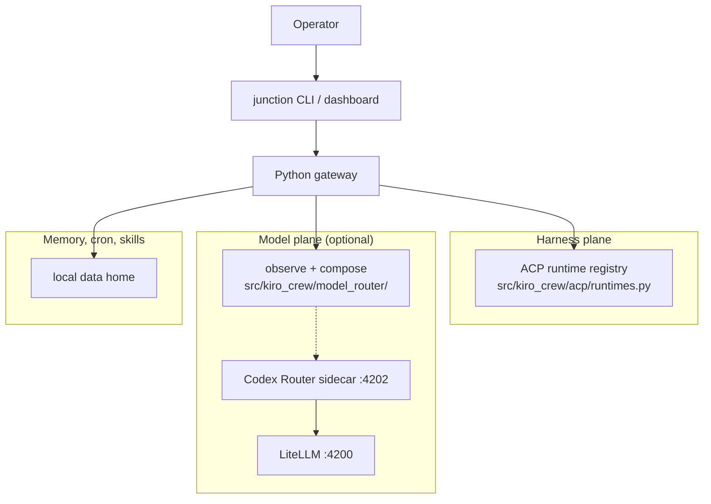

# Architecture — two planes

Junction is a **local control plane** that docks ACP agents and routes their
models. Combining this tree with Codex Router is two planes in one product,
not a Node dump into Python.

Decision records: [ADR 0002](docs/adr/0002-two-planes.md) (compose, do not
dump) and [ADR 0003](docs/adr/0003-sidecar-not-vendor.md) (observe the
sidecar; do not vendor it). Security invariants stay
[ADR 0004](docs/adr/0004-security-unchanged.md). This cut is preview, not
production: [ADR 0005](docs/adr/0005-preview-not-production.md).

The upstream component map remains
[`docs/architecture/overview.md`](docs/architecture/overview.md). This file
is the Junction thesis that sits on top of it.

## Shape

Operator → `junction` CLI / dashboard → Python gateway → **harness plane**
(ACP registry) **and** **model plane** (optional Codex Router sidecar on
loopback, typically `:4202` + LiteLLM `:4200`) **and** memory / cron /
skills.

## Harness plane

Already on `main`. `agent.acp_backend` defaults to `auto` via
`src/kiro_crew/acp/runtimes.py`. Resolution preference is Cursor, Claude,
Codex, Kimi, DeepSeek Harness, Goose, Grok, Pi, Droid, then `kiro-cli`.
Unknown values degrade to `auto`, not to `kiro-cli`.

`agent.provider` stays `acp`. Multi-ACP must not be re-landed. An added
harness adapts; it does not widen the Kiro path. Identity is positive
(`is_kiro_backend` / membership sets). Spec:
[`docs/system-specs/modules/harness-parity.md`](docs/system-specs/modules/harness-parity.md).

`kiro-cli` is optional. If no spec-family runtime is installed and
`kiro-cli` is absent, session spawn fails with a runtime-not-found error
rather than implying a hidden install.

## Model plane

This cut **observes and composes**. Python health, the namespaced model-choice
catalog, and the role DAG live in `src/kiro_crew/model_router/`. The sidecar
is the published Codex Router (or a later, separately decided subset).
Junction does not vendor the Node tree, copy tray / widget / Electron /
public Cursor HTTPS tunnel / ACP agent bridges, or reimplement LiteLLM.

Catalog slugs (for example `kimi-oauth/k3`, `deepseek/deepseek-v4-pro`) are
the model choices. Live-catalog providers such as GitHub Copilot ship as
provider rows without hardcoded model ids. Role routing maps
orchestration → planning → execution (plus background / subagent) onto
cost classes (economy / standard / capable) so tokens buy the most work.
Unpinned roles stay `"auto"` until an advertised set is known; operators
may pin `agent.role_models.<role>`.

If the sidecar is absent or unhealthy, the ACP gateway still runs. That
degradation is documented, not silent. Spec:
[`docs/system-specs/modules/model-router.md`](docs/system-specs/modules/model-router.md).

Agents may optionally point `openai_base_url` at the model plane (M2).
Junction never pastes provider keys into chat, never logs secrets, and
never treats a capability URL as display copy.

## Memory, cron, skills

Unchanged in role: the gateway already owns cross-session memory, cron,
and skills. The two-plane join does not relocate that state. Data home
identifiers stay `KIROCREW_HOME` / `~/.kiro/crew` until a dedicated rename.

## Degradation

| Sidecar | Gateway | Operator-visible |
|---|---|---|
| Healthy on loopback | Full: harness + model route | Health/status reports ready |
| Installed, not running | Harness only | Degraded: model plane down |
| Not installed | Harness only | Degraded: model plane absent |
| Probe fails closed | Harness only | Degraded: unreachable, no secrets |

A missing model plane is not a gateway crash.

## Compose surface

CLI `junction up` (compose then serve; `junction gateway` is the same server),
`junction planes`, `junction doctor --quick`, `junction doctor` (Planes
section first), and `GET /api/planes` return one snapshot: harness inventory
(auto preference; kiro-cli last and optional), model-sidecar health, and the
orchestration → planning → execution role DAG. They do not spawn agents, leave
loopback, or change the Kiro harness path. Existing `junction router
status|catalog|plan` routes stay the model-plane detail views. The JSON
snapshot does not carry a dedicated vendor-cli key — optional is an inventory
flag on the runtime row. Human text for planes, doctor, and `up` is formatted
in one function so the three surfaces cannot drift.

