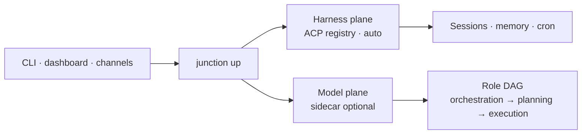

> **Junction** is a local control plane: dock ACP coding agents and route
> their models. CLI: `junction`. A vendor agent CLI is optional. Default:
> `"agent": { "acp_backend": "auto" }`. See [PRODUCT.md](PRODUCT.md) and
> [ARCHITECTURE.md](ARCHITECTURE.md).

<h1 align="center">Junction</h1>

<p align="center">
  <strong>Where coding agents meet the models you want.</strong>
</p>

<p align="center">
  Run Cursor, Claude, Codex, Grok from one local dashboard — and route their
  inference to Kimi, DeepSeek, Copilot, and the rest — with memory and cron.
  Two planes: an ACP harness registry already on this tree, and an optional
  model sidecar.
</p>

<p align="center">
  <a href="#quick-start"></a>
  <a href="docs/README.md"></a>
  <a href="docs/guides/install.md"></a>
  <a href="CONTRIBUTING.md"></a>
  <a href="SECURITY.md"></a>
  <a href="LICENSE"></a>
</p>

<p align="center">
  <a href="#quick-start">Quick start</a> ·
  <a href="#build-from-source">Build from source</a> ·
  <a href="#why-junction">Why Junction</a> ·
  <a href="#what-junction-does">Capabilities</a> ·
  <a href="#how-it-works">How it works</a> ·
  <a href="#security-and-control">Security</a> ·
  <a href="#install-configure-and-operate">Install</a> ·
  <a href="#anonymous-usage-telemetry">Telemetry</a> ·
  <a href="#docs-and-contributing">Docs</a>
</p>

## Quick start

On macOS and Linux, one command clones this repository, builds the dashboard
(Python 3.10+ and Node.js 22+), and links `junction`. Read
[`scripts/get-junction.sh`](scripts/get-junction.sh) before you run it.
A vendor agent CLI is optional. The gateway docks whichever ACP runtime is
installed (`agent.acp_backend` defaults to `auto`).

```bash
curl -fsSL https://raw.githubusercontent.com/laqaer/junction/main/scripts/get-junction.sh | sh
junction setup
junction up
```

The script tracks the default branch. It does not start the server. Windows,
and anyone working in a checkout, follows the source steps below.

### Install from source

After a source install the dashboard is on loopback.

```bash
git clone https://github.com/laqaer/junction.git
cd junction
bash minimal_install.sh
junction setup
junction up
```

Optional model plane: run a sidecar on loopback, then `junction planes` for
both rails and the role DAG, or `junction router catalog` and
`junction router plan` for the detail views.

Desktop packages are a later cut.

### Build from source

macOS and Linux require Python 3.10+, Node.js 22+ (24 LTS recommended), and
npm. An ACP runtime is optional. Windows is supported
through a native source install; follow the
[Windows guide](docs/guides/windows-install.md) instead of the shell steps below.

```bash
# 1. Clone and build Junction
git clone https://github.com/laqaer/junction.git
cd junction
make build
source .venv/bin/activate

# 2. Configure, verify, and start (the CLI is `junction`)
junction setup
junction doctor --quick
junction up
```

## Why Junction

A coding-agent CLI is one harness talking to one vendor model. Junction is
the local switch: dock several ACP agents, then route their inference through
a role DAG so orchestration stays cheap and planning stays capable.

**Two planes.** The harness plane docks Cursor, Claude, Codex, Grok, and the
rest from one registry (`agent.acp_backend` defaults to `auto`). The model
plane is an optional sidecar — if it is down, the gateway still runs. Never
paste provider keys into chat.

**Spend on purpose.** Orchestration, planning, and execution each pick a cost
class. Pins in `agent.role_models` still win.

**Stays on your machine.** Sessions, memory, and cron survive restarts. The
dashboard binds to loopback. Chat from the dashboard, the CLI, or a messaging
channel.

## What Junction does

| Capability | What it gives you |
|---|---|
| **Two planes** | Dock ACP agents on the harness plane. Route inference on the optional model plane. `junction up` composes both, then serves the dashboard on loopback. |
| **Role routing** | Orchestration, planning, and execution each pick a cost class so cheap models coordinate and capable models plan. Pins in `agent.role_models` still win. Never paste provider keys into chat. |
| **Persistent sessions** | Concurrent conversations, resume after restarts, search prior threads, and carry context into new work. |
| **Lessons and skills** | Corrections become durable lessons. Repeated patterns become reusable skills you can inspect or drop. |
| **Walk-away tasks** | Hand Junction a spec. It plans, executes, validates, retries, and resumes from checkpoints. |
| **Cron and channels** | Schedule agent work or deterministic scripts. Continue from the dashboard, the CLI, or a messaging surface without moving state. |
| **Delegation** | Spawn isolated subagents for parallel work and fold their results back into the parent thread. |
| **Apps and MCP** | Add dashboard pages, scoped gateway APIs, and extra tools without changing the core runtime. |
| **Visible execution** | Watch tool calls, subagent progress, approvals, schedules, memory, and logs from the dashboard. |
| **Defense in depth** | Tool approvals, OS sandboxing, sensitive-path checks, credential redaction, deny rules, and governance profiles. |

You can also paste a screenshot and ask what is causing an error. Junction sends
the image to the session’s model and keeps the diagnosis in the conversation
history.

The complete inventory is in [Features](src/kiro_crew/docs/index.md) and
[What's New](CHANGELOG.md).

## How it works



`junction up` composes both planes, then binds the dashboard to loopback.
The harness plane docks whichever ACP runtime is installed (`agent.acp_backend`
defaults to `auto`; a vendor agent CLI is optional). The model plane is an optional
sidecar — if it is down, the gateway still runs. Role routing spends cheap
tokens on orchestration and capable tokens on planning. Pins in
`agent.role_models` still win. Never paste provider keys into chat.

Everything runs on a host you control: your Mac, a container on this machine,
or a remote Linux box. Conversation history, memory, and knowledge indexes stay
there.

**Use the surface that fits the moment.**

| Surface | Best for |
|---|---|
| **Desktop app** | The simplest local experience, with a bundled Gateway plus multi-tab connections to local or remote Gateways. |
| **Web dashboard** | Parallel conversations, files, approvals, activity, memory, schedules, apps, settings, and system status at `localhost:5476`. |
| **Slack** | Work from DMs and threads with streaming replies, approvals, notifications, and session links back to the dashboard. |
| **Telegram** | Reach your agent from private DMs on your phone or laptop, with streaming replies, inline approvals, and commands. |
| **Discord** | Work from DMs with streaming replies and approvals delivered as message buttons. |
| **Teams** | Reach your agent from Microsoft Teams chats — replies arrive as complete messages, and approvals are answered by typing. |
| **Webex** | Work from Webex direct messages with streaming replies and inline approvals. |
| **WeCom** | Chat through an outbound-connected WeCom AI bot with configured user access and streaming replies. |
| **WeChat (Weixin)** | Reach your agent from WeChat with configured user access and streaming replies. |
| **CLI** | Fast interactive chat and direct automation with `junction chat`, `run`, `cron`, `spawn`, and `security`. |

**Choose how work starts.**

| Mode | Use it for | Entry point |
|---|---|---|
| **Scheduled** | Briefings, audits, backups, and recurring maintenance | `junction cron` or a natural-language request |
| **Proactive** | Goals that need another pass without waiting for a new user message | AutoNudge and goal-loop skills |
| **Reactive** | CI alerts, external automation, messaging-channel activity, and other events | Authenticated agent webhooks and messaging events |
| **Task runner** | Bounded projects with explicit steps, tests, review, and checkpoint resume | `junction run TASK.md` |
| **Subagents** | Independent workstreams that can run concurrently | `junction spawn run "task"` |

**Memory, learning, and evolution.** Junction maintains preferences, active
project context, decaying history summaries, and durable lessons. Corrections
and task failures can change later behavior, while repeated patterns can become
reusable skills. In-process embeddings add semantic retrieval for memory and
the knowledge library. The stored state remains inspectable and editable
from the dashboard. Incognito and temporary session modes let you opt out when
a conversation should not persist.

**Skills, MCP, and apps.** Markdown skills supply reusable workflows and can be
loaded only when relevant. Built-in MCP servers expose task, subagent, learning,
messaging, scheduling, and desktop-automation tools. You
can discover additional MCP servers from local configuration. The
App Kit adds installable interfaces and domain workflows. Apps can add dashboard
pages, use scoped Gateway APIs, subscribe to events, and register lifecycle
hooks.

## Security and control

Junction gives an AI agent real tool access, so the controls are enforced at
the runtime boundary instead of relying only on prompt instructions.

- **Local by default.** The dashboard binds to loopback unless you explicitly
  configure a network URL. Remote dashboards require token authentication.
- **Interactive approvals.** Review tool requests in the dashboard or a
  connected messaging channel like Slack, Discord, or Telegram.
  Session-scoped trust can reduce repeated prompts without changing
  the underlying deny and sensitive-path controls.
- **OS sandbox.** On Linux and macOS, agent subprocesses can run inside namespace or
  Seatbelt isolation. Standard, strict, and off modes make the tradeoff
  explicit. Windows offers no equivalent OS-level layer, so Junction fails
  closed there: agent subprocesses are refused rather than run unconfined, until
  you declare the
  [`sandbox_allow_unsandboxed_exec` opt-in](docs/guides/windows-install.md#the-unsandboxed-exec-opt-in).
- **Sensitive data guards.** Junction blocks direct access to protected paths,
  strips sensitive environment variables, and redacts credential patterns from
  output before it reaches a chat surface.
- **Denied operations.** Bundled deny patterns block destructive commands and
  common exfiltration paths even when a session has broad approval.
- **Auditability.** Security events and tool activity are recorded for review.
  Use `junction security events`, `audit`, and `verify` to inspect them.
- **Governance ceiling.** Optional policy and profile files compose with a
  tightest-wins model. A running app or agent can narrow the allowed scope but
  cannot loosen the enterprise ceiling. Inspect it with `junction policy show`,
  `validate`, and `explain`.

No agent security layer removes the need to protect credentials and review
high-impact actions. Avoid pasting secrets or sensitive personal data into a
chat. Read the [security architecture](docs/architecture/security-deep-dive.md) and use
[SECURITY.md](SECURITY.md) for private vulnerability reporting.

## Install, configure, and operate

**Installer details.** The installer resolves the channel feed, verifies the wheel's SHA-256 against
the published manifest, installs through `pipx` when available or a managed
virtual environment at `~/.kiro/crew-venv` (beside the data home; override with
`KIROCREW_VENV`), and records the channel in `~/.kiro/crew/channel`. The channels
are `stable`, `insider`, and `nightly`, and `KIROCREW_CHANNEL` sets the default.
On Linux and macOS, when the system lacks a Python 3.10+ interpreter the
installer provisions one itself — no package manager, no sudo: it downloads a
SHA-256-pinned [uv](https://docs.astral.sh/uv/) binary (or uses your installed
`uv`) and installs a python-build-standalone CPython 3.12 into
`~/.kiro/crew-python`. Pass `--managed-python` to always use the provisioned
interpreter and skip the system ones. The
signed installer never pipes an unsigned third-party script into a shell.

**Pin an exact wheel.** You can also install one exact wheel directly and pin it to its published
SHA-256. Every version directory publishes a `SHA256SUMS` file next to the
wheel, so take the hash for your wheel from there and put it in the URL
fragment. `pip` verifies the hash and does not consult a package index for
Junction itself:

```bash
pip install .
```

**Semantic memory.** Semantic memory needs no setup. Embeddings run in-process, and the Gateway
downloads its embedding model in the background on first start, verifies it,
and stores it under `~/.kiro/crew/models`. Until the model lands, memory search
falls back to keyword search and picks up embeddings automatically without a
restart. Set `KIROCREW_EMBED_MODEL_URL` to point at a mirror for airgapped
installs.

See [Installing and Building](docs/guides/install.md) for wheels, desktop builds,
Windows, optional voice dependencies, and manual setup.

**Choose where Junction runs.** The current deployment model keeps the Gateway,
agent session runtime, ACP processes, and state together on one host. Your Apps
and chat surfaces connect to that Gateway.

| Deployment | How to run it | Where Junction and its state live |
|---|---|---|
| **Mac app, local** | Install or build the desktop app with `make desktop` | The app starts its bundled Gateway. Agent sessions, ACP processes, and `~/.kiro/crew` stay on your Mac. |
| **Native local** | `make build`, or install a wheel from `make wheel` | The Gateway and agent runtime run directly on your macOS, Linux, or Windows machine. |
| **Local container** | Build from this checkout and persist the data home | The Gateway and agent runtime run in a container on your machine. |
| **Remote hardware** | Follow the [remote host guide](docs/guides/remote-and-mobile.md) and install the service | The Gateway, agent sessions, and state run continuously on your Linux server, home lab, or cloud instance. Connect the desktop app or browser through an SSH tunnel. |
| **Windows source install** | Follow [the Windows guide](docs/guides/windows-install.md) | The Gateway, agent sessions, chat, cron, and dashboard run natively with documented feature limits. |

For containers, mount the directory selected by `KIROCREW_HOME` so sessions,
configuration, memory, and credentials survive replacement. Keep the Gateway
port bound to loopback unless you intentionally configure authenticated remote
access. Container isolation and the Junction OS sandbox are separate layers
and depend on the host runtime configuration. See the
[Docker guide](docs/guides/docker.md) for the published image and deployment details.

**Keep it running.** Install a systemd service on Linux or a launchd agent on
macOS:

```bash
junction service install
junction service status
junction logs
```

To bind a non-default port (for example a host where `5476` is already taken),
set `KIROCREW_PORT` when you install the service — the value is baked into the
unit:

```bash
KIROCREW_PORT=5477 junction service install
```

To change it later without reinstalling, edit the service environment file
created by `service install` and restart with `junction service` / `junction restart`.
installed by releases before v0.2.0 lack the `EnvironmentFile=` directive that
reads this file — re-run `junction service install` or use a systemd drop-in;
see [the install guide](docs/guides/install.md#setting-the-service-port).

The desktop app can use this local Gateway or connect to a remote one. For an
always-on VPS, home server, or cloud VM in your account, follow the
[remote host guide](docs/guides/remote-and-mobile.md). Junction does not require a
Junction-hosted control plane.

**Configure it.** User data lives under `~/.kiro/crew` by default. Manage the
main configuration with `junction config get`, `set`, and `edit`.

```json
{
  "agent": {
    "provider": "acp",
    "approval_mode": "interactive",
    "sandbox": "auto"
  },
  "session": {
    "timeout_secs": 1800,
    "pool_size": 2
  },
  "dashboard": {
    "bot_name": "Junction"
  }
}
```

`agent.provider` is fixed to `acp`. The gateway drives an ACP runtime over the
Agent Client Protocol (a vendor agent CLI is optional). Set the dashboard port with `KIROCREW_PORT` or
`junction up --port <n>`. Messaging-channel credentials (Slack, Discord,
Telegram, and the rest) live in `~/.kiro/crew/.env` rather than the JSON config.

**Troubleshoot quickly.** Start with `junction doctor --quick`, then `junction doctor`. For an ACP timeout,
confirm an ACP runtime is installed (`junction planes`), then allow extra time for the
first MCP startup. For memory search, check that the embedding
model finished downloading under `~/.kiro/crew/models`. For a stale MCP configuration, run
`junction setup --agent-only`, or add `--clean` to rebuild it.

**Find the logs.** When you need to debug, the fastest path is
`junction logs` (tail the most recent gateway output) or `junction logs -f` to
follow it live; `junction logs -n 200` prints more history. `junction logs`
reads the right source automatically — the systemd journal when the Linux
service is installed, the launchd stdout file on macOS, or the foreground
gateway log otherwise. Raise verbosity with `junction up -v` (INFO:
session lifecycle and context usage) or `-vv` (DEBUG: full ACP events and
message traces); set the persistent default with
`junction config set agent.log_level`, or change it at runtime from the
dashboard **Logs** page. Under `~/.kiro/crew` (or your `KIROCREW_HOME`) you can
also read the raw files directly:

| File | What it holds |
|---|---|
| `~/.kiro/crew/gateway.log` | Main gateway log when running in the foreground. |
| `~/.kiro/crew/security_events.jsonl` | Append-only security and tool-access events. Inspect with `junction security events`, `audit`, and `verify`. |
| `~/.kiro/crew/audit.log` | Human-readable audit trail of privileged operations. |
| `~/.kiro/crew/subagents/<agent_id>/result.txt` | Full transcript of a completed subagent, kept for a grace window after it finishes. |

See the [Troubleshooting guide](src/kiro_crew/docs/troubleshooting.md) for the
full log-level reference and emergency recovery steps.

## Anonymous usage telemetry

Junction sends **one anonymous heartbeat per day** so maintainers can see how
many copies are actively running, which versions are in use, and which
platforms and install channels to support. After a successful install or update
from the official app catalog, it also sends one anonymous per-app receipt.
Both signals are on by default and use the same controls below.

To turn it off, flip **Settings → Privacy → Send anonymous usage heartbeat** in
the dashboard (the same switch appears on the last step of first-run
onboarding). Or from a terminal:

```bash
junction telemetry disable        # persists to config.json
export KIROCREW_TELEMETRY_DISABLED=1   # or per-shell / per-container
junction telemetry status         # print exactly what would be sent
```

The toggle and `junction telemetry disable` write the same setting, so either
one sticks across restarts and upgrades. `KIROCREW_TELEMETRY_DISABLED` overrides
both — when it is set, the dashboard toggle is disabled and says so.

**Exactly these five fields are sent, at most once per day, and nothing else:**

| Field | Example | Why |
|-------|---------|-----|
| Random instance id | `9c75560d…` (UUID4) | Lets us count how many copies ran on a given day. Generated once on first run and derived from nothing — not your hostname, username, MAC, IP, or any account. It identifies an installed copy, never a person. |
| App version | `0.1.2` | Which releases are still in use. **Release number only** — build stamps like `-nightly.20260731t065756` are stripped before sending, because a per-build timestamp is near-unique and would help identify a specific machine. |
| Python minor version | `3.12` | When the minimum can move up |
| Install channel | `dmg` | Which install path people actually use |
| First-run flag | `1` / `0` | New installs vs returning |

**Official-app install receipts are separate and event-based.** After a
successful official-catalog install or update, Junction sends one GET to
`/b/1/install/<app-slug>?t=<token>&k=<fresh|update>&v=<release>` on the same
telemetry host. The slug is the public catalog identifier. `t` is the first 32
hex characters of HMAC-SHA256 keyed by the local beacon install id over
`app-install:<slug>`; the raw install id is never sent, and tokens for different
apps cannot be linked to assemble an installed-app profile. `k` separates fresh
installs from updates, and `v` is the same release-only Junction version clamp
used by the heartbeat.

Receipts are emitted only for bundled or edition-provided official catalog
entries. Apps from user-configured registries, local-directory installs, and
self-registered apps emit nothing, so private app names never leave the machine.
If no persistent beacon install id exists yet, the receipt is skipped.

This list used to be nine fields. Release channel, OS, CPU architecture and
governance posture were **removed** — each was coarse on its own, but the
instance id is stable, so those attributes all describe the *same* copy and
together they narrowed the group any one install blends into far more than any
single field suggests.

We report this as **Daily Active Instances** rather than "users": Junction has
no account system of its own, and a harness sign-in used for model access is
never read or sent. There is no way to resolve a copy to a person, so one
person running Junction on three machines counts as three instances.

**Never sent:** your prompts, model responses, file contents, file paths, repo
or branch names, credentials, environment variables, hostname, username, or IP
address. The receiving CDN is configured **not to log client IP addresses** — the
log delivery does not include that field, so no IP is stored at all.

**Automatically off** in CI, and whenever `KIROCREW_HOME` points somewhere other
than `~/.kiro/crew` (dev instances and pods are never counted).

**Enterprise administrators can pin it off entirely.** A `capabilities.telemetry`
entry in the security policy blocks both outbound signals regardless of the local
setting, and the dashboard toggle then says so instead of offering a change that
would not take effect:

```json
{"version": 1, "boot": {"fail_closed": true},
 "capabilities": {"telemetry": {"enabled": false}}}
```

See [docs/system-specs/modules/governance.md](docs/system-specs/modules/governance.md).

This is separate from `telemetry.enabled`, which controls **local-only**
performance metrics that never leave your machine. See
[docs/system-specs/modules/metrics.md](docs/system-specs/modules/metrics.md).

## Docs and contributing

| Topic | Start here |
|---|---|
| Install and packaging | [Install and build](docs/guides/install.md), [Windows](docs/guides/windows-install.md), [Docker](docs/guides/docker.md), [Desktop](docs/build/desktop-app.md), [Remote host](docs/guides/remote-and-mobile.md), [Release process](docs/build/release.md) |
| Product capabilities | [Features](src/kiro_crew/docs/index.md), [Skills](skills/README.md), [All user docs](src/kiro_crew/docs/README.md) |
| All documentation | [docs/](docs/README.md) for contributor and architecture docs |
| Channels | [Slack](docs/guides/slack-setup.md), [Discord](src/kiro_crew/docs/discord-integration.md), [Telegram](src/kiro_crew/docs/telegram-integration.md), [Teams](src/kiro_crew/docs/teams-integration.md), [Webex](src/kiro_crew/docs/webex-integration.md), [WeCom](src/kiro_crew/docs/wecom-integration.md), [WeChat (Weixin)](src/kiro_crew/docs/weixin-integration.md), [WhatsApp](src/kiro_crew/docs/whatsapp-integration.md) |
| Architecture | [System architecture](docs/architecture/overview.md), [Memory](docs/system-specs/modules/memory-skills-hooks.md), [MCP](docs/architecture/mcp.md), [App Kit](docs/app-kit/getting-started.md) |
| Trust and dependencies | [Security](docs/architecture/security-deep-dive.md), [Security policy](SECURITY.md) |
| Project work | [Contributing](CONTRIBUTING.md), [Tenets](TENETS.md), [Governance](GOVERNANCE.md), [Maintainers](MAINTAINERS.md), [AI assistant rules](AGENTS.md), [Changelog](CHANGELOG.md) |

Contributions are welcome. Create a branch from `main`, keep changes focused,
and run the relevant checks before opening a pull request:

```bash
# Backend
pip install -e ".[voice]" --group dev
pytest

# Frontend
cd website
npm ci
npm run check
npm run build
```

Use [GitHub Issues](https://github.com/laqaer/junction/issues) for bugs and
feature requests. Do not file security vulnerabilities publicly.


## Contributors

Junction credits authors of pull requests merged in this repository. The
[contributors graph](https://github.com/laqaer/junction/graphs/contributors)
is the live list as the project grows.

<a href="https://github.com/laqaer" title="laqaer"></a>

If you contributed and would like to be added, corrected, or removed, please
open an issue or a pull request.

## License

Junction is licensed under the [Apache License 2.0](LICENSE). See
[NOTICE](NOTICE) for attribution information.
